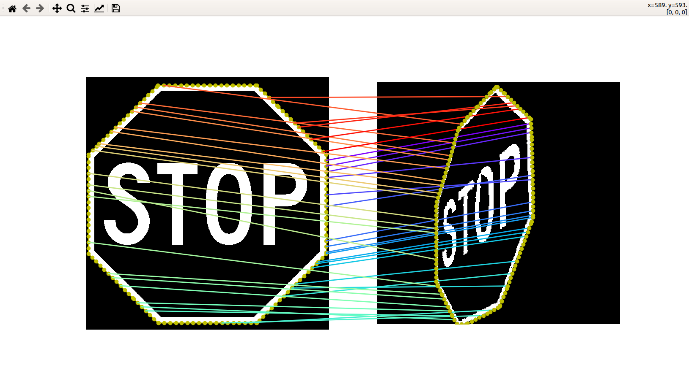

# Cross Ratio Arrays: A Descriptor Invariant to Severe Projective Deformation and Robust to Occlusion for Planar Shape Recognition.

This is an implementation of Cross Ratio Array (CRA) shape descriptor in Python. CRA is truly Projective Invariant and robust to occlusion and was published in **Computers & Graphics** journal.

In this repository, you will find the source code of CRA, the used datasets with projectively deformed shapes in different elevation and azimuth angles, and also occluded shapes in different occlusion percentages. 

## Highlights

- Cross Ratio Arrays is a truly projective invariant shape descriptor. 
- It has a superior discriminative power for inner structures than
previous methods. 
- It outperforms state-of-the-art methods when severe projectivities are involved. 
- It can handle occlusion to a
higher degree than in previous articles (up to 50%). 
- It can be made easily parallelizable.


## Instalation

Install packages using pip (or pip3) with requirements.txt file.

```sh

    pip install -r requirements.txt

```

## Example of Use
Below is shown an executable script that compares two images using CRA to scan and to compare the features of the planar shapes and returns NTE metric (a shape distance explained in our paper).

```sh

    python3 main_perspective_invariant_shape_descriptor.py

```

The program will to show a graphic window to the user to choose two images.

After scanning and matching processes are finished the graphic output is shown like this:




The terminal shows the NTE value that is with the name "Hull points distance" and this value is multiplied by 100.

It is possible to change the sample used in this script, by default was used 150. Below is shown SAMPLE flag and others that are possible to change.
```python
# ================================= FLAGS ===================================== #

# plot: 
showScanRays = False
showMatchRays = False # MATCH RAYS
showTrajectories = False

# scan: tomographic, convex-hull
convex_hull_scan_template = True
convex_hull_scan_test = True

# convex-hull fan-beam parameters
SAMPLE = 150

template_nFanBeam = SAMPLE
test_nFanBeam = SAMPLE
emitter_points_number = SAMPLE
```

## Reference

If you find CRA useful, please cite the following paper:

CHARAMBA, Luiz G.; MELO, Silvio; DE LIMA, Ullayne. *Cross Ratio Arrays: A Descriptor Invariant to Severe Projective Deformation and Robust to Occlusion for Planar Shape Recognition*. **Computers & Graphics**, 2021. https://doi.org/10.1016/j.cag.2021.08.001

    @article{charamba2021cross,
    title={Cross Ratio Arrays: A Descriptor Invariant to Severe Projective Deformation and Robust to Occlusion for Planar Shape Recognition.},
    author={Charamba, Luiz G and Melo, Silvio and de Lima, Ullayne},
    journal={Computers \& Graphics},
    year={2021},
    publisher={Elsevier}
    }

    
